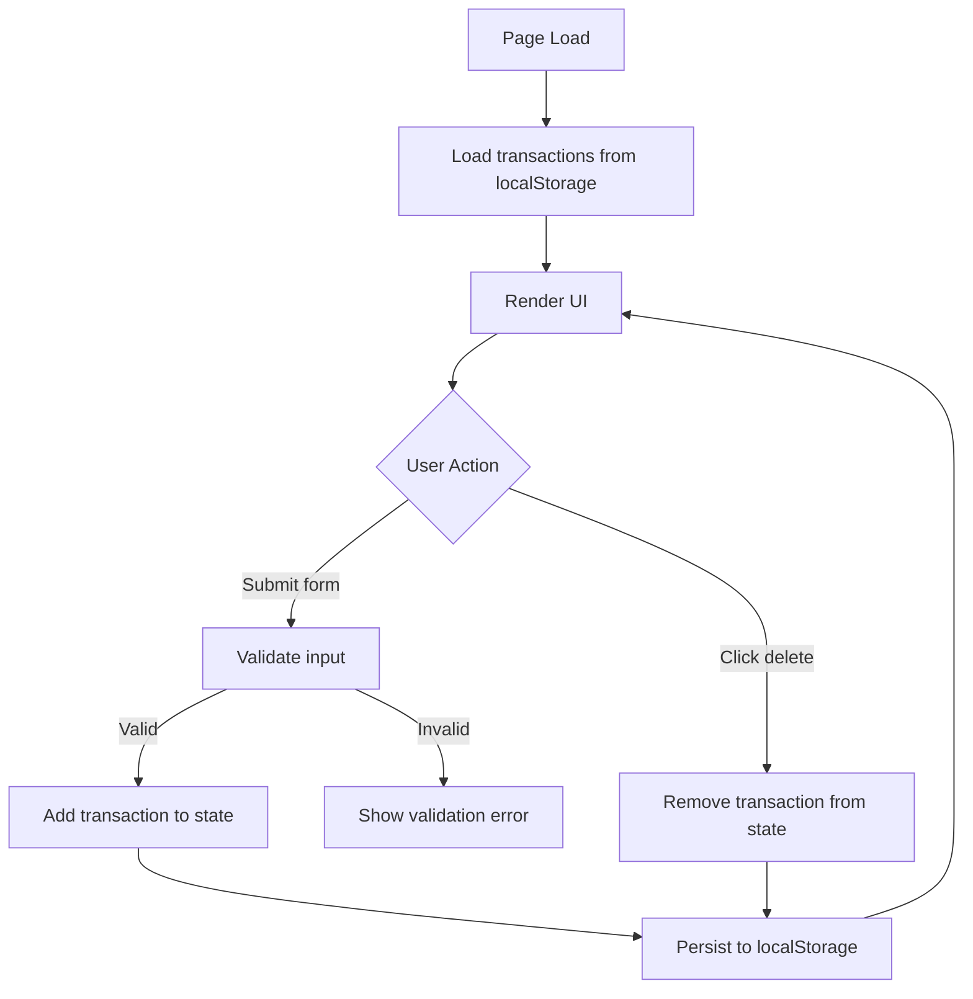

# Design Document: Expense & Budget Visualizer

## Overview

The Expense & Budget Visualizer is a single-page, client-side web application built with HTML, CSS, and vanilla JavaScript. It allows users to record spending transactions, view them in a scrollable list, track a running total balance, and visualize category-based spending via a Chart.js pie chart. All data is persisted to `localStorage` so the app survives page refreshes without a backend.

The app is delivered as a single `index.html` file (with optional companion `style.css` and `app.js` files). No build step, no framework, no server required.

---

## Architecture

The app follows a simple **data → render** cycle:

```
User Action
    │
    ▼
State Mutation (add / delete transaction)
    │
    ▼
Persist to localStorage
    │
    ▼
Re-render all UI components
    ├── Balance display
    ├── Transaction list
    └── Pie chart (Chart.js)
```

All state lives in a single in-memory array (`transactions`). Every mutation persists the full array to `localStorage` and then triggers a full re-render of all dependent UI components. This keeps the data flow unidirectional and easy to reason about.



---

## Components and Interfaces

### 1. Add Transaction Form

Renders a `<form>` with three inputs and a submit button.

**Inputs:**
- `itemName` — text input, required, non-empty after trimming
- `amount` — number input, required, must be a finite positive number
- `category` — `<select>` with options: Food, Transport, Fun

**Behavior:**
- On submit, validate all fields. If invalid, display an inline error message and abort.
- If valid, call `addTransaction(itemName, amount, category)`.
- On success, reset the form.

**Interface:**
```js
// Reads form values, validates, calls addTransaction or shows error
function handleFormSubmit(event) { ... }
```

### 2. Transaction List

Renders a scrollable `<ul>` or `<div>` containing one row per transaction.

**Each row displays:**
- Item name
- Amount (formatted as currency, e.g. `$12.50`)
- Category badge
- Delete button

**Behavior:**
- Delete button calls `deleteTransaction(id)`.
- When the list is empty, shows a placeholder message ("No transactions yet").

**Interface:**
```js
function renderTransactionList(transactions) { ... }
```

### 3. Balance Display

A single `<span>` or `<p>` at the top of the page showing the sum of all transaction amounts.

**Interface:**
```js
function renderBalance(transactions) { ... }
// Returns: sum of all transaction amounts (number)
function computeBalance(transactions) { ... }
```

### 4. Spending Distribution Chart

A `<canvas>` element managed by a Chart.js `Pie` instance.

**Behavior:**
- Groups transactions by category and sums amounts per category.
- Updates the existing Chart.js instance on every re-render (avoids creating duplicate canvases).
- When `transactions` is empty, destroys/hides the chart and shows an empty-state `<p>` message.

**Interface:**
```js
function renderChart(transactions) { ... }
// Returns: { Food: number, Transport: number, Fun: number }
function computeCategoryTotals(transactions) { ... }
```

### 5. State / Storage Module

Manages the in-memory `transactions` array and `localStorage` persistence.

**Interface:**
```js
// Load from localStorage on startup
function loadTransactions() { ... }          // returns Transaction[]

// Persist current state
function saveTransactions(transactions) { ... }

// Mutate state
function addTransaction(name, amount, category) { ... }
function deleteTransaction(id) { ... }
```

---

## Data Models

### Transaction

```js
/**
 * @typedef {Object} Transaction
 * @property {string} id        - Unique identifier (crypto.randomUUID or Date.now().toString())
 * @property {string} name      - Item name (trimmed, non-empty string)
 * @property {number} amount    - Positive finite number
 * @property {string} category  - One of: "Food" | "Transport" | "Fun"
 */
```

### localStorage Schema

Key: `"expense_transactions"`  
Value: JSON-serialized `Transaction[]`

```json
[
  { "id": "1720000000000", "name": "Lunch", "amount": 12.50, "category": "Food" },
  { "id": "1720000001000", "name": "Bus pass", "amount": 30.00, "category": "Transport" }
]
```

### Category Totals (derived, not stored)

```js
/**
 * @typedef {Object} CategoryTotals
 * @property {number} Food
 * @property {number} Transport
 * @property {number} Fun
 */
```

---

## Correctness Properties

*A property is a characteristic or behavior that should hold true across all valid executions of a system — essentially, a formal statement about what the system should do. Properties serve as the bridge between human-readable specifications and machine-verifiable correctness guarantees.*

### Property 1: Valid transaction addition

*For any* valid triple of (non-empty item name, positive finite amount, valid category), calling `addTransaction` and then reading the transaction list should result in a list that contains an entry matching that name, amount, and category.

**Validates: Requirements 1.2**

---

### Property 2: Invalid input rejection

*For any* input where at least one field is invalid (empty/whitespace name, non-positive or non-numeric amount, or missing category), the `validateTransaction` function should return an error and the transaction list should remain unchanged in length and content.

**Validates: Requirements 1.3, 1.4**

---

### Property 3: Transaction list reflects state

*For any* array of transactions, the rendered transaction list should contain exactly one row per transaction, and each row should display the correct name, amount, and category — no more, no fewer entries than the state array.

**Validates: Requirements 2.1, 2.3**

---

### Property 4: Balance equals sum of amounts

*For any* array of transactions, `computeBalance(transactions)` should equal the arithmetic sum of all `transaction.amount` values in that array (and equal `0` for an empty array).

**Validates: Requirements 3.1, 3.2, 3.3**

---

### Property 5: Category totals correctness

*For any* array of transactions, `computeCategoryTotals(transactions)` should return an object where each category's value equals the sum of amounts of all transactions belonging to that category, and categories with no transactions have a value of `0`.

**Validates: Requirements 4.1, 4.2, 4.3**

---

## Error Handling

| Scenario | Handling |
|---|---|
| Empty item name (or whitespace only) | Show inline error: "Item name is required." Abort submit. |
| Amount is empty | Show inline error: "Amount is required." Abort submit. |
| Amount is non-numeric | Show inline error: "Amount must be a number." Abort submit. |
| Amount is zero or negative | Show inline error: "Amount must be greater than zero." Abort submit. |
| No category selected | Show inline error: "Please select a category." Abort submit. |
| `localStorage` read fails (e.g. private browsing quota) | Catch the exception, log a warning, start with an empty array. |
| `localStorage` write fails | Catch the exception, log a warning, continue (in-memory state is still valid). |
| Chart.js not loaded (CDN failure) | The chart section will be absent; the rest of the app still functions. |

Validation errors are displayed as a single `<p class="error">` element inside the form, cleared on each new submit attempt.

---

## Testing Strategy

### Dual Testing Approach

Both unit tests and property-based tests are required. They are complementary:

- **Unit tests** cover specific examples, edge cases, and integration points.
- **Property-based tests** verify universal correctness across randomly generated inputs.

### Unit Tests (specific examples & edge cases)

- Form renders with all three fields and the correct category options (validates Requirement 1.1).
- Empty transactions array renders the empty-state message and hides the chart canvas (validates Requirement 4.4).
- `computeBalance([])` returns `0`.
- `computeCategoryTotals([])` returns `{ Food: 0, Transport: 0, Fun: 0 }`.
- Deleting the only transaction leaves an empty list and shows the placeholder.
- `localStorage` parse failure falls back to an empty array without throwing.

### Property-Based Tests

Use **fast-check** (JavaScript property-based testing library).  
Configure each test to run a minimum of **100 iterations**.

Each test must include a comment referencing its design property using the tag format:  
`// Feature: expense-budget-visualizer, Property {N}: {property_text}`

**Property 1 — Valid transaction addition**  
Generate: random non-empty string (name), random positive finite number (amount), random element of `["Food", "Transport", "Fun"]` (category).  
Assert: after `addTransaction(name, amount, category)`, the returned/updated list contains exactly one entry matching all three fields.  
`// Feature: expense-budget-visualizer, Property 1: valid transaction addition`

**Property 2 — Invalid input rejection**  
Generate: inputs where at least one field is invalid (empty string, `0`, negative number, `NaN`, non-numeric string).  
Assert: `validateTransaction(name, amount, category)` returns a non-null error string, and the transaction list length is unchanged.  
`// Feature: expense-budget-visualizer, Property 2: invalid input rejection`

**Property 3 — Transaction list reflects state**  
Generate: random arrays of valid transactions (0–50 items).  
Assert: `renderTransactionList` produces a DOM structure with exactly `transactions.length` rows, each containing the correct name, amount, and category.  
`// Feature: expense-budget-visualizer, Property 3: transaction list reflects state`

**Property 4 — Balance equals sum of amounts**  
Generate: random arrays of valid transactions.  
Assert: `computeBalance(transactions) === transactions.reduce((s, t) => s + t.amount, 0)`.  
`// Feature: expense-budget-visualizer, Property 4: balance equals sum of amounts`

**Property 5 — Category totals correctness**  
Generate: random arrays of valid transactions.  
Assert: for each category `c`, `computeCategoryTotals(transactions)[c] === transactions.filter(t => t.category === c).reduce((s, t) => s + t.amount, 0)`.  
`// Feature: expense-budget-visualizer, Property 5: category totals correctness`
